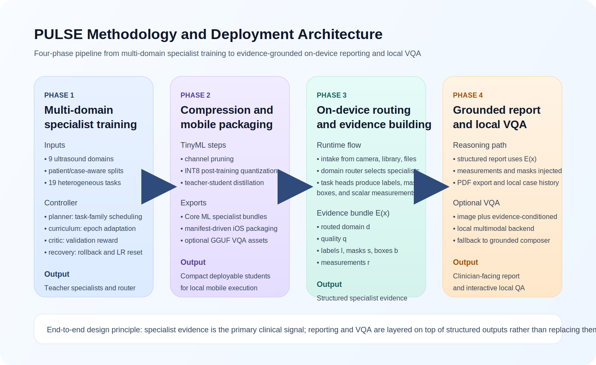
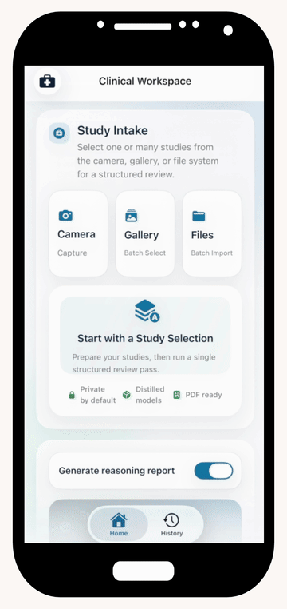

# PULSE: Point-of-care Ultrasound via Lightweight Scalable Embedded TinyML

PULSE is a multi-domain ultrasound intelligence stack spanning supervised specialist training, model compression, structured runtime inference, and an on-device iPhone application.

This repository is intentionally code-only. It excludes datasets, trained checkpoints, exported Core ML bundles, staged GGUF reasoning models, papers, presentations, reports, and other working artifacts.

## Architecture



The pipeline is organized in four phases: multi-domain specialist training with an agentic RL-style controller, TinyML compression and mobile packaging, on-device routing plus structured evidence construction, and grounded report generation with optional local VQA.

## Demo

<p align="center">
  <a href="assets/demo.mp4">
    
  </a>
</p>

<p align="center">
  Click the preview to open the full demo video.
</p>

## What PULSE Does

- Routes a point-of-care ultrasound image to the correct clinical domain.
- Runs specialist models across heterogeneous output types:
  - classification
  - segmentation
  - detection
  - scalar measurement
- Builds a structured evidence bundle from specialist outputs.
- Generates clinician-facing structured reports from evidence rather than free-form image-only reasoning.
- Deploys a local SwiftUI iPhone app with Core ML specialists and optional on-device VQA.

## Scope

PULSE covers 9 ultrasound domains and 19 runtime tasks.

| Domain | Runtime scope |
| --- | --- |
| Cardiac / Multi-POCUS | Butterfly view classification, cardiac screening proxy |
| Breast | Lesion classification, lesion segmentation |
| Thyroid | Benign/malignant classification, nodule detection, multimodal fusion |
| Fetal | Plane routing, brain sub-plane reasoning, HC/BPD/AC/FL biometry via fetal specialists |
| Abdominal | Organ classification, anomaly detection |
| Liver | Pathology classification, segmentation |
| Kidney | Anatomy segmentation, normal/abnormal classification |
| PCOS | Binary classification |
| Carotid | Lumen segmentation, IMT proxy measurement |

## Repository Layout

```text
PULSE/
├── app/                              FastAPI app and minimal web client
├── assets/                           README demo assets
├── ios/PULSEOnDevice/                SwiftUI iPhone app and iOS build spec
├── pulse/                            Core training, runtime, export, and reporting code
├── scripts/                          Curated entrypoints for training, export, runtime, and staging
├── third_party/MobileFetalCLIP/      Vendored foundation-model compression code
├── requirements.txt                  Base Python dependencies
└── requirements-coreml.txt           Optional Core ML export dependencies
```

## Core Components

### `pulse/`

This is the main Python package.

- `pulse/discovery.py`: dataset discovery and patient/case-aware task construction
- `pulse/trainer.py`: shared supervised training loop
- `pulse/training_policy.py`: agentic RL-style training controller for scheduling, curriculum, and recovery
- `pulse/coreml_export.py`: export path from trained specialists to Core ML
- `pulse/runtime/service.py`: structured runtime orchestration
- `pulse/runtime/reporting.py`: clinician-facing report generation from structured outputs

### `app/`

FastAPI service for local structured inference.

- `/api/health`
- `/api/tasks`
- `/api/analyze`

### `ios/PULSEOnDevice/`

SwiftUI iPhone app for fully local deployment.

- domain routing on-device
- specialist inference on-device
- structured report generation on-device
- optional local VQA using staged GGUF multimodal assets

### `third_party/MobileFetalCLIP/`

Vendored MobileFetalCLIP training code used for the fetal foundation-model compression track, including selective repulsive knowledge distillation.

## Getting Started

### 1. Create a Python environment

```bash
python3 -m venv .venv
source .venv/bin/activate
pip install --upgrade pip
pip install -r requirements.txt
```

### 2. Run the local runtime API

```bash
python3 scripts/run_agent_server.py \
  --data-root Datasets \
  --model-root runs/pulse_retrain_new \
  --runtime-root runs/pulse_runtime
```

Then open:

- `http://127.0.0.1:8000`
- API docs: `http://127.0.0.1:8000/api/docs`

### 3. Train specialists

Single task:

```bash
python3 scripts/train_task.py --help
```

Sequential multi-task run:

```bash
python3 scripts/train_all_sequential.py --help
```

Preflight split and one-batch validation:

```bash
python3 scripts/preflight_train.py --help
```

## Training Design

PULSE uses standard supervised objectives for each task family:

- weighted cross-entropy or focal loss for classification
- Dice-style segmentation losses
- objectness plus box regression for detection
- Smooth L1 for scalar measurement tasks

On top of this, `pulse/training_policy.py` adds a lightweight agentic RL-style control layer that manages:

- task-family scheduling
- epoch-level curriculum adjustments
- minority-focused sampling
- recovery from plateau or degradation

The controller optimizes training behavior, not diagnosis.

## Compression and Export

The codebase supports three compression tracks:

- channel pruning
- post-training INT8 quantization
- teacher-student distillation

Relevant entrypoints:

- `scripts/export_coreml.py`
- `scripts/export_fetal_specialists_coreml.py`
- `scripts/prepare_ios_models.py`
- `scripts/generate_compression_report.py`

## iPhone App

The iPhone app source lives in `ios/PULSEOnDevice/`.

It is generated through XcodeGen:

```bash
cd ios/PULSEOnDevice
xcodegen generate
open PULSEOnDevice.xcodeproj
```

The repository does not ship:

- compiled Core ML bundles
- GGUF reasoning backends
- training checkpoints
- external dataset payloads

Instead, the repo includes the source code plus staging/export scripts needed to reproduce those assets locally.

See:

- `ios/PULSEOnDevice/README.md`
- `ios/PULSEOnDevice/PULSEOnDevice/Resources/Models/README.md`
- `ios/PULSEOnDevice/PULSEOnDevice/Resources/Reasoning/README.md`

## Curated Scripts Included Here

### Training and evaluation

- `scripts/train_all_sequential.py`
- `scripts/train_task.py`
- `scripts/preflight_train.py`
- `scripts/inspect_datasets.py`
- `scripts/evaluate_new_test_datasets.py`
- `scripts/evaluate_external_breast_segmentation.py`

### Runtime and export

- `scripts/run_agent_server.py`
- `scripts/export_coreml.py`
- `scripts/export_fetal_specialists_coreml.py`
- `scripts/prepare_ios_models.py`
- `scripts/export_inference_casebook.py`
- `scripts/generate_ios_profiling_table.py`

### Local VQA asset staging

- `scripts/download_medix_r1_mobile_assets.py`
- `scripts/stage_medix_r1_reasoning_assets.py`
- `scripts/test_medix_r1_output.py`

## Deliberately Excluded From Version Control

This repository does not track:

- `Datasets/`
- `runs/`
- `exports/`
- `external_models/`
- staged `*.gguf` assets
- exported `*.mlmodelc` / `*.mlpackage` assets
- papers, presentations, reports, and proposal material

That separation keeps the repository small, reviewable, and reproducible.

## Acknowledgement

PULSE includes vendored or integrated components where appropriate, including MobileFetalCLIP for fetal foundation-model compression experiments and an iOS `llama.cpp` / `mtmd` bridge for local multimodal reasoning research.
