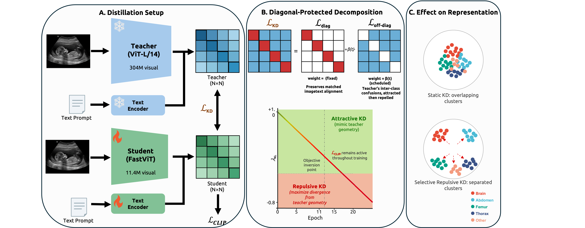
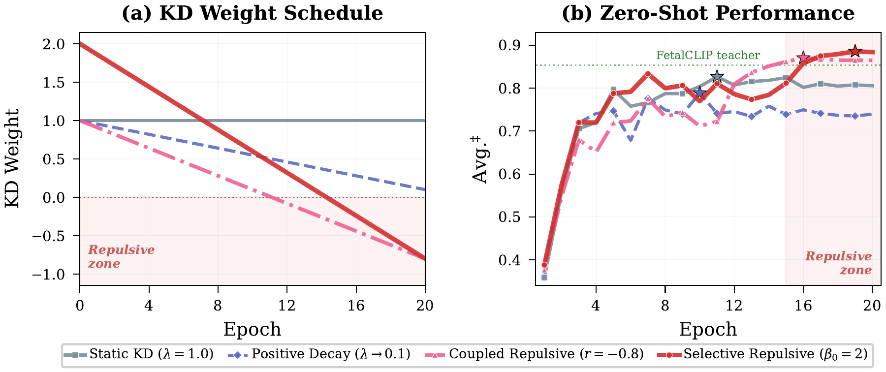
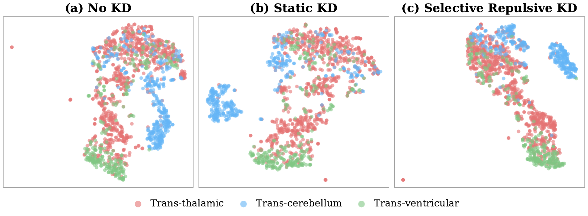

<div align="center">

# MobileFetalCLIP

### Selective Repulsive Knowledge Distillation for Mobile Fetal Ultrasound Analysis

[](https://www.numansaeed.com/mobilefetalclip/)
[](https://arxiv.org/abs/2603.05421)
[](https://huggingface.co/collections/numansaeed/fetal-ultrasound-models)
[](LICENSE)
[](https://www.python.org/)
[](https://pytorch.org/)

[Project Website](https://www.numansaeed.com/mobilefetalclip/) | [Paper](https://arxiv.org/abs/2603.05421) | [Hugging Face / Model Weights](https://huggingface.co/collections/numansaeed/fetal-ultrasound-models) | [SonoSight Demo](#sonosight-demo) | [Checkpoints](#checkpoints) | [Quick Start](#quick-start) | [Reproduce Results](#reproduce-paper-results)

</div>

---

## Highlights

- **26x fewer parameters** &mdash; 11.4M visual encoder (FastViT) vs. 304M (ViT-L/14)
- **Surpasses the teacher** on zero-shot HC18 biometry validity (**88.6%** vs. 83.5%) and brain sub-plane F1 (**0.784** vs. 0.702)
- **Real-time on-device inference** &mdash; 1.6 ms on iPhone 16 Pro (635 FPS), 24x faster than FetalCLIP
- **97-98% linear probing retention** of the teacher's downstream performance

## SonoSight Demo

SonoSight is the mobile app prototype built on top of MobileFetalCLIP for handheld fetal
ultrasound assistance. Watch the full 25-second demo on the project website.

[](https://www.numansaeed.com/mobilefetalclip/#sonosight-demo)

<div align="center">

<br>
<em><b>Figure 1.</b> Overview of MobileFetalCLIP. (A) Distillation setup with frozen FetalCLIP teacher. (B) Selective Repulsive KD decomposes the KD loss into diagonal (fixed, preserving image-text alignment) and off-diagonal (scheduled, transitioning from attraction to repulsion) components. (C) The repulsive phase forces discovery of architecturally native features, producing well-separated clusters.</em>
</div>

---

## Abstract

Foundation models for fetal ultrasound require hundreds of millions of parameters, precluding point-of-care deployment. We distill FetalCLIP (ViT-L/14, 304M image-encoder parameters) into **MobileFetalCLIP**, a FastViT-based mobile model (11.4M image parameters). Standard knowledge distillation (KD) is limited under such large capacity gaps (~26x), as the student cannot reproduce the teacher's architectural properties.

We introduce **Selective Repulsive Knowledge Distillation**, which decomposes the contrastive KD loss into diagonal (matched-pair) and off-diagonal (non-target) components. The diagonal remains attractive, preserving image-text alignment, while the off-diagonal weight decays into negative values, forcing discovery of *architecturally native* features. MobileFetalCLIP surpasses the FetalCLIP teacher in zero-shot HC18 biometry validity and brain sub-plane F1, while maintaining competitive 5-plane classification, with 26x fewer visual parameters.

---

## Method: Selective Repulsive KD

The total training objective is:

```
L = L_CLIP + lambda_KL(t) * L_KD
```

**Selective decomposition** splits the KD loss into two components:

```
L_KD = L_diag + beta(t) * L_off-diag
```

| Component | Weight | Role |
|---|---|---|
| **Diagonal** (matched pairs) | Fixed at 1.0 | Preserves image-text alignment throughout training |
| **Off-diagonal** (non-target) | Scheduled: beta_0 -> beta_0 * r | Attracts early, then *repels* once weight crosses zero |

The off-diagonal weight follows a linear schedule parameterized by initial value beta_0 and minimum ratio r:

```
beta(t) = beta_0 * (1 - (t/T) * (1 - r))
```

When r < 0, the weight eventually becomes negative, inverting the gradient to actively push the student away from the teacher's inter-class confusion structure.

### Training Phases

1. **Attractive phase** (beta > 0): Standard KD &mdash; student absorbs domain knowledge from the teacher
2. **Transition** (beta ~ 0): KD contributes negligibly; student driven primarily by L_CLIP
3. **Repulsive phase** (beta < 0): Gradient inverts &mdash; student discovers architecturally native features

<div align="center">

<br>
<em><b>Figure 2.</b> Training dynamics. (a) KD weight schedule: repulsive variants cross into negative values. (b) Zero-shot performance exhibits a characteristic "late surge" once entering the repulsive phase; Selective Repulsive KD achieves the highest final score, exceeding the FetalCLIP teacher.</em>
</div>

---

## Results

### Zero-Shot Performance

| Model | Params | HC18 Val. (%) | Class F1 | Avg. |
|---|---:|---:|---:|---:|
| *FetalCLIP Teacher (ViT-L/14)* | *427M* | *83.5* | *0.871* | *0.853* |
| CLIP (ViT-L/14) | 427M | 11.0 | 0.270 | 0.190 |
| BiomedCLIP (ViT-B/16) | 150M | 24.0 | 0.466 | 0.353 |
| UniMed-CLIP (ViT-B/16) | 150M | 9.0 | 0.495 | 0.293 |
| MobileFetalCLIP &mdash; No KD | 75M | 71.3 | 0.823 | 0.768 |
| MobileFetalCLIP &mdash; Static Logit KD | 75M | 79.4 | 0.859 | 0.826 |
| MobileFetalCLIP &mdash; Coupled Repulsive KD | 75M | 84.4 | 0.869 | 0.857 |
| **MobileFetalCLIP &mdash; Selective Repulsive KD** | **75M** | **88.6** | **0.886** | **0.886** |

### On-Device Inference (CoreML, fp16, batch 1)

| Model | Vis. Params | GMACs | iPhone 16 Pro | iPhone 17 Pro |
|---|---:|---:|---:|---:|
| FetalCLIP (ViT-L/14) | 304M | 38.9 | 37.6 ms | 31.9 ms |
| **MobileFetalCLIP (FastViT)** | **11.4M** (26x &darr;) | **1.2** (32x &darr;) | **1.6 ms** (24x &darr;) | **1.4 ms** (23x &darr;) |

> MobileFetalCLIP's encoder runs at **635 FPS** on iPhone 16 Pro &mdash; well beyond the 30-60 FPS typical of diagnostic ultrasound, enabling real-time assistive AI in point-of-care workflows.

### Linear Probing (Frozen Features)

| Model | 6-View F1 | Brain F1 | CHD AUROC |
|---|---:|---:|---:|
| FetalCLIP (ViT-L/14) | .947 | .820 | .787 |
| **MobileFetalCLIP (FastViT)** | **.930** | **.799** | **.769** |
| *Retention* | *98.2%* | *97.4%* | *97.7%* |

### Feature Space Analysis

<div align="center">

<br>
<em><b>Figure 3.</b> t-SNE projections of brain sub-plane embeddings. (a) No KD: overlapping clusters. (b) Static KD: marginal improvement. (c) Selective Repulsive KD: well-separated, compact clusters.</em>
</div>

---

## Quick Start

### Installation

```bash
git clone https://github.com/numanai/MobileFetalCLIP.git
cd MobileFetalCLIP
python -m venv .venv
source .venv/bin/activate
pip install -r requirements.txt
pip install -e .
```

### Dataset Preparation

Place your licensed datasets into the layout expected by the training code:

```bash
python tools/prepare_dataset.py \
  --source-train-shards "/path/to/shard_{0000000001..0000000025}.tar" \
  --source-fetal-planes-images "/path/to/FETAL_PLANES_DB/Images" \
  --source-fetal-planes-csv "/path/to/FETAL_PLANES_DB_data.csv" \
  --source-hc18-images "/path/to/HC18/training_set" \
  --source-hc18-csv "/path/to/training_set_pixel_size_and_HC.csv"
```

Validate:

```bash
python tools/validate_dataset.py --strict
```

Expected layout:

```text
data/
  pretraining/
    shards/
      shard_0000000001.tar
      ...
  eval/
    FETAL_PLANES_DB/
      Images/
      FETAL_PLANES_DB_data.csv
    HC18/
      training_set/
      training_set_pixel_size_and_HC.csv
```

Expected CSV columns:

- `FETAL_PLANES_DB_data.csv`: `Image_name`, `Plane`, `Brain_plane`, `Train `
- `training_set_pixel_size_and_HC.csv`: `filename`, `pixel size(mm)`, `head circumference (mm)`

### Training

Reproducing training requires a local MobileCLIP2-S0 initialization checkpoint for
`--pretrained`. That base checkpoint is **not** published in the Hugging Face collection shown
below.

```bash
bash scripts/run_experiment.sh \
  --experiment-id selective-beta2-to-neg-0p8 \
  --model-config configs/model/mobileclip2_s0_fetal.json \
  --pretrained /path/to/mobileclip2_s0.pt \
  --teacher checkpoints/FetalCLIP_weights.pt
```

### Evaluation

To evaluate the released MobileFetalCLIP checkpoint from Hugging Face:

```bash
python -m mobile_fetal_clip.cli eval \
  --model-config configs/model/mobileclip2_s0_fetal.json \
  --checkpoint checkpoints/mobile_fetal_clip_weights.pt \
  --eval-config configs/default.yaml \
  --output-json outputs/eval/mobile_fetal_clip_eval.json
```

For a locally reproduced run, replace `--checkpoint` with
`outputs/experiments/selective-beta2-to-neg-0p8/checkpoints/best.pt`.

### On-Device Benchmarking

```bash
bash scripts/benchmark_inference.sh \
  --model-id mobileclip2_s0 \
  --model-config configs/model/mobileclip2_s0_fetal.json \
  --finetuned-ckpt checkpoints/mobile_fetal_clip_weights.pt \
  --device cpu \
  --scope both \
  --batch-sizes 1,16 \
  --warmup 20 \
  --iters 100 \
  --repeats 3 \
  --output-json outputs/benchmarks/mobileclip2_s0_cpu.json
```

---

## Reproduce Paper Results

Available experiment ids:

- `no-kd`
- `static-kd`
- `repulsive-r-neg-0p5`
- `repulsive-r-neg-0p8`
- `coupled-beta2-to-neg-0p8`
- `confidence-penalty`
- `selective-beta1-to-neg-0p8`
- `selective-beta2-to-neg-0p8`
- `selective-beta4-to-neg-0p8`
- `selective-beta8-to-neg-0p8`

**Main suite** (Table 1):

```bash
bash scripts/run_reproduce_suite.sh \
  --suite main \
  --model-config configs/model/mobileclip2_s0_fetal.json \
  --pretrained /path/to/mobileclip2_s0.pt \
  --teacher checkpoints/FetalCLIP_weights.pt
```

**Full ablation suite** (Table 3):

```bash
bash scripts/run_reproduce_suite.sh \
  --suite ablation \
  --model-config configs/model/mobileclip2_s0_fetal.json \
  --pretrained /path/to/mobileclip2_s0.pt \
  --teacher checkpoints/FetalCLIP_weights.pt
```

---

## Checkpoints

The [Hugging Face collection](https://huggingface.co/collections/numansaeed/fetal-ultrasound-models)
currently publishes these two checkpoints:

- `numansaeed/fetalclip-model` with `FetalCLIP_weights.pt`
- `numansaeed/MobileFetalCLIP` with `mobile_fetal_clip_weights.pt`

If you only want to run the released models, create a local `checkpoints/` directory and place:

- `checkpoints/FetalCLIP_weights.pt`
- `checkpoints/mobile_fetal_clip_weights.pt`

If you want to reproduce training from this repository, you will also need a separate
MobileCLIP2-S0 initialization checkpoint for `--pretrained`. That file is not distributed in the
Hugging Face collection above.

Training runs you launch yourself will write fine-tuned checkpoints under
`outputs/experiments/<experiment-id>/checkpoints/`.

---

## Repository Structure

```
MobileFetalCLIP/
├── assets/                  # README figures
├── configs/                 # Model and experiment configurations
├── scripts/                 # Training, evaluation, and benchmarking scripts
├── src/                     # Core library
├── tests/                   # Unit and integration tests
├── tools/                   # Dataset preparation and validation utilities
├── LICENSE
├── requirements.txt
└── pyproject.toml
```

---

## Citation

```bibtex
@article{saeed2026mobilefetalclip,
  title     = {MobileFetalCLIP: Selective Repulsive Knowledge Distillation
               for Mobile Fetal Ultrasound Analysis},
  author    = {Saeed, Numan and Maani, Fadillah Adamsyah and Yaqub, Mohammad},
  journal   = {arXiv preprint arXiv:2603.05421},
  year      = {2026},
  url       = {https://arxiv.org/abs/2603.05421}
}
```

---

## License

This project is released under the [CC BY-NC 4.0](LICENSE).

---

<div align="center">
<sub>MobileFetalCLIP &mdash; Bringing foundation-model intelligence to point-of-care fetal ultrasound.</sub>
</div>
